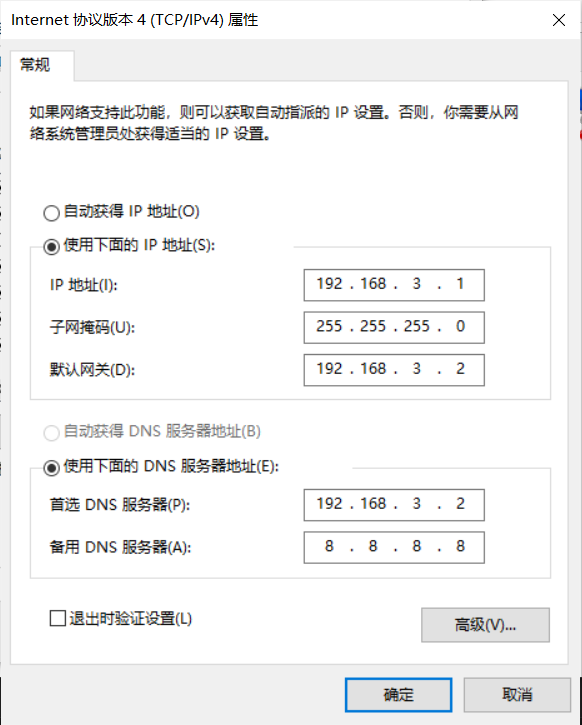
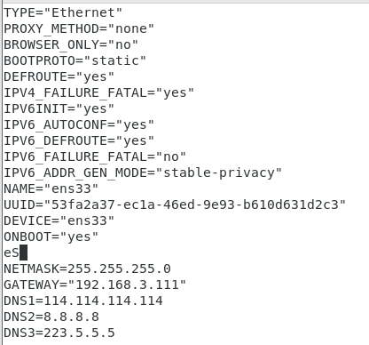
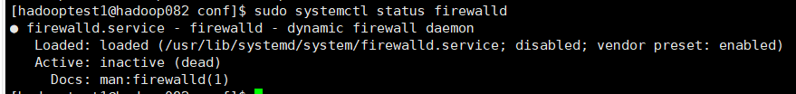
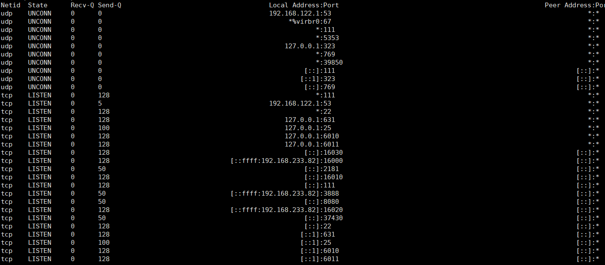
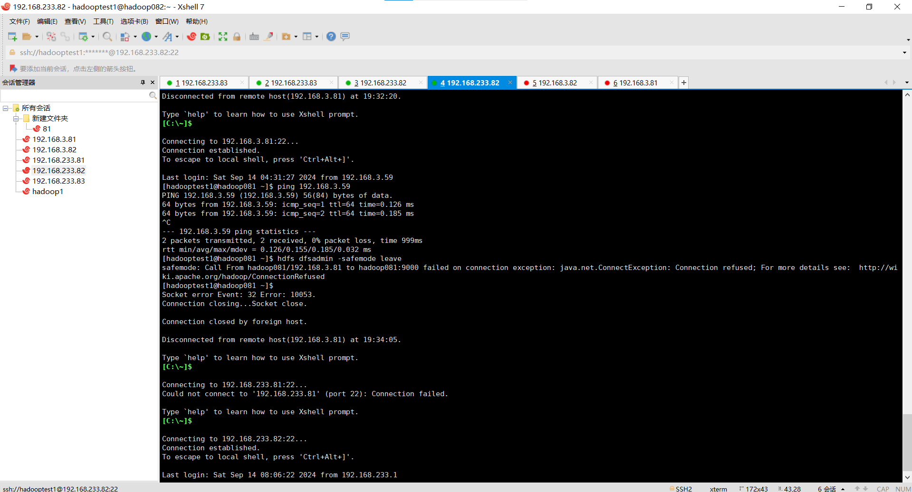
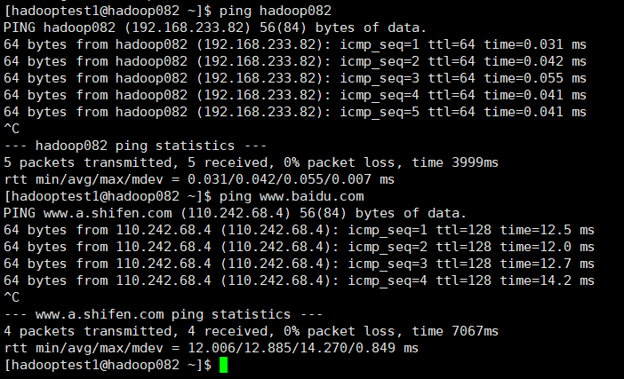
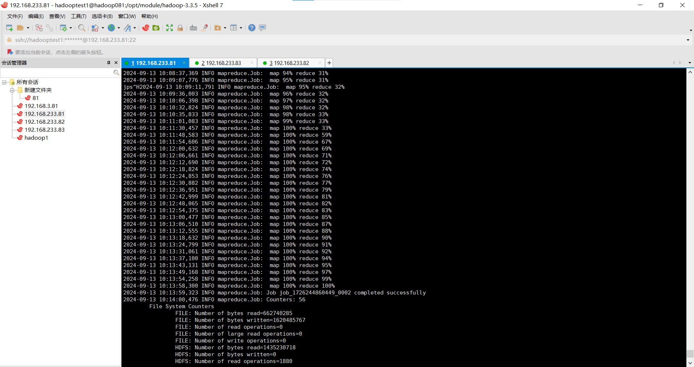
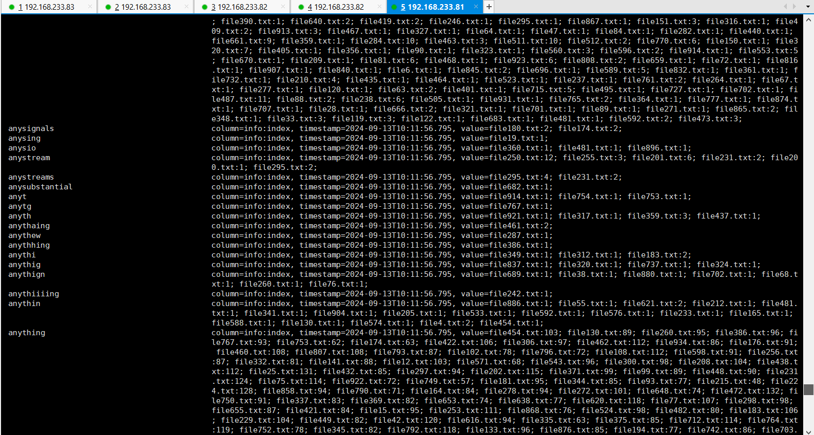

<div style="text-align: center;">
<br/>
<br/>
<br/>
<br/>

# 大数据系统开发实践实验报告


### 题　　目： 大数据系统开发实践

### 学　　院： 计算机学院

### 专业名称： 计算机科学与技术

### 小组成员：

成员1
成员2
成员3

### 任课教师： 郭贵锁

### 日　　期： 2024年9月14日

</div>
<div style="page-break-after: always;"></div>

## 1.搜索引擎的技术方案
### 1.1功能描述
wkw负责写
### 1.2技术选型
随着搜索引擎需要处理超高并发和超大数据量，国内多数搜索引擎采用集中式架构，导致服务器性能要求高、可扩展性差、宽带浪费和重复性工作等问题，难以应对日益增长的数据规模。而基于分布式架构的搜索引擎，如Hadoop，能够提供高性能、低成本的解决方案，因此在搜索引擎中引入Hadoop是必要的。<br>
#### Hadoop 生态系统简介
Hadoop是Apache基金会开发的开源分布式系统基础架构，具有高扩展性和容错性。它的核心组件包括：<br>
- **HDFS（Hadoop Distributed File System）**：分布式存储系统，采用Master/Slave结构，负责将文件拆分成多个数据块存储在不同节点上。<br>
- **YARN（Yet Another Resource Negotiator）**：集群资源管理和任务调度的核心框架。<br>
- **MapReduce**：Hadoop的数据处理引擎，支持大数据的并行计算。<br>
- **HBase**：面向列的分布式数据库，适用于大规模数据的随机读写。<br>
- **Hive**：基于Hadoop的数据仓库工具，支持SQL查询。<br>
- **Spark**：通用的大数据快速计算引擎，适合低延迟和迭代处理需求。<br>
- **ZooKeeper**：分布式协调服务，负责系统的配置管理、同步和故障恢复。<br>
Hadoop的核心是HDFS提供存储支持，MapReduce负责数据计算。基于这些特点，Hadoop可以很好地满足分布式搜索引擎的需求。<br>
#### 1.2.1 Hadoop 的优势
1. **高效的数据处理**：通过MapReduce并行处理大量数据，能显著减少数据处理时间。例如，18GB数据在集群环境下比单机节省了4.8倍的时间。随着数据规模的增加，Hadoop的效率优势愈发明显。<br>
2. **开源与低成本**：Hadoop是开源平台，使用成本较低，团队可以将更多资金投入到应用开发中。开源带来了快速的技术更新和社区支持。<br>
3. **高扩展性**：Hadoop支持集群扩展，能动态添加计算节点，以满足不断增加的数据处理需求，且不会影响集群的性能。<br>
4. **安全性和容错性**：HDFS通过数据块的副本机制确保数据安全，系统可以从节点故障中快速恢复。Hadoop自动分配失败任务，确保任务的连续性和数据的完整性。<br>
5. **适合中小型团队**：Hadoop的架构能够减少对硬件的依赖，使中小型开发团队可以在有限的资源下实现高效的数据分析和搜索服务。<br>
#### 1.2.2 Hadoop 的劣势
尽管Hadoop有许多优势，但在某些场景中仍然存在一些局限性，特别是在Hadoop 3.x版本中体现得更为明显：<br>
1. **不适用于低延迟的数据访问**：Hadoop主要适合批处理任务，不适合需要快速响应的实时应用场景。<br>
2. **处理大量小文件效率低**：Hadoop的文件块默认大小为128MB或256MB，处理大量比块大小小得多的文件时（如小于1MB），效率较低。这些小文件会使NameNode超载，导致性能瓶颈。<br>
3. **不支持多用户同时写入和修改文件**：HDFS对文件的修改限制较多，无法灵活地进行多用户并发写入和修改操作。<br>
4. **安全性问题**：由于Hadoop使用Java编写，而Java作为一种广泛使用的语言，容易成为网络攻击的目标，Hadoop系统的安全性容易受到挑战。<br>
5. **处理开销大**：Hadoop依赖磁盘I/O，数据从磁盘读取和写入的过程耗时较长，特别是在处理PB级数据时，读写操作变得非常昂贵。Hadoop无法实现内存中计算，导致整体处理开销大。<br>
6. **仅支持批处理**：Hadoop的核心MapReduce引擎设计用于批处理任务，不适合流处理或需要低延迟的实时应用。<br>
7. **迭代处理效率低**：Hadoop的MapReduce模型不适合迭代处理，特别是在机器学习或需要多阶段处理的数据流中。每个阶段的输出必须作为下一个阶段的输入，缺乏灵活性。<br>
#### 1.2.3 结论
Hadoop凭借其高效、低成本、易扩展的特点，适合作为分布式搜索引擎的基础架构。然而，对于实时性要求高或涉及大量小文件的场景，Hadoop的效率会大打折扣。在这种情况下，可以考虑将Hadoop与其他大数据工具（如Spark）结合使用，以弥补其不足，提高搜索引擎的性能和灵活性。<br>
### 1.3 功能实现
yjx负责写
### 1.4 工作计划
**阶段一：设计Hadoop分布式计算引擎**<br>
**目标**：建立一个基于Hadoop的分布式计算引擎，支持海量数据的高效处理。<br>

**任务**：<br>
研究Hadoop框架的基本原理和组件（如HDFS、MapReduce、YARN等）。<br>
设计适用于搜索引擎的数据处理架构，特别是数据抓取和预处理的管道。<br>
实现Hadoop集群的部署与配置，确保高可用性和扩展性。<br>
优化Hadoop作业的执行，减少数据处理的延迟和资源消耗。<br>
重点：选择合适的调度算法和数据分区策略，以优化数据抓取和处理的性能。<br>

**阶段二：嵌入倒排索引技术（全文检索）**<br>
**目标**：实现基于倒排索引的全文检索功能，以支持高效的搜索查询。<br>

**任务**：<br>
理解倒排索引的结构和构建过程，包括词项、文档频率、倒排列表等。<br>
设计倒排索引的生成算法，确保索引构建的效率和准确性。<br>
集成全文检索库（如Lucene），或者自定义开发全文检索模块。<br>
实现索引更新策略（增量更新、全量重建等）以适应动态数据变化。<br>
重点：优化索引存储结构和查询算法，提升查询的响应速度和准确性。<br>

**阶段三：实现中文分词技术**<br>
目标：设计并实现中文分词算法，提高中文搜索结果的准确性。<br>

**任务**：<br>
调研现有的中文分词算法（如正向最大匹配、双向最大匹配、统计模型等）并选型。<br>
实现分词算法并进行性能优化，支持自定义词典和词性标注。<br>
解决分词中的歧义问题，提高分词的准确率。<br>
集成分词模块与倒排索引构建过程，以支持中文文本的有效索引和检索。<br>
重点：平衡分词的准确性和性能，处理好词库维护和动态更新的问题。<br>

**阶段四：设计分布式数据库系统**<br>
**目标**：设计一个高效的分布式数据库系统，用于存储和管理海量数据。<br>

**任务**：<br>
分析业务需求，确定需要存储的数据类型（文档元数据、用户行为数据等）。<br>
选型分布式数据库系统（如HBase、Cassandra、Elasticsearch等），并设计数据模型。<br>
设计数据库的分区和副本策略，以提高数据的读写性能和可靠性。<br>
优化数据库的索引策略，确保高效的数据查询和检索性能。<br>
重点：设计合理的数据分片和副本管理策略，平衡数据一致性和可用性。<br>
<br>
**阶段五：开发Web客户端**<br>
**目标**：开发一个友好的Web前端，提供用户高效的搜索体验。<br>
<br>
**任务**：<br>
设计用户界面（UI）和用户体验（UX），确保简洁易用的操作流程。<br>
实现前端功能模块（如搜索框、搜索结果展示、过滤器等）。<br>
提供智能提示和自动补全功能，以提高用户输入效率。<br>
集成前端与后端API接口，确保数据的实时性和准确性。<br>
重点：关注用户体验，确保前端页面的响应速度和交互性。<br>
<br>
**阶段六：测试和功能完善**<br>
**目标**：全面测试系统功能，修复缺陷并优化性能。<br>
<br>
**任务**：<br>
制定测试计划，进行单元测试、集成测试、性能测试和用户测试。<br>
收集测试反馈，修复Bug和优化功能，确保系统的稳定性和可用性。<br>
完善日志和监控系统，确保故障的快速定位和恢复。<br>
进行负载测试和安全测试，优化系统的扩展性和安全性。<br>
重点：全面测试和持续优化，确保系统在高并发和大数据量下的稳定运行。<br>

### 1.5 组织结构

### 1.6 软件质量保证
zjr负责

## 2.倒排索引的实现
### 2.1 实验要求
运用MapReduce算法计算,构建一个倒排索引, 将倒排索引存储在HBase中,数据为老师提供的sentence.txt文件。
### 2.2 实验进度
- 9.6-9.8 完成集群初步配置<br>
- 9.9-9.11 伪分布式和单机完全分布式集群启动成功<br>
- 9.12 完成倒排索引的代码编写<br>
- 9.13 完成三机完全分布式集群启动成功，单机完全分布式倒排运行成功<br>
- 9.14 三机完全分布式倒排运行成功
### 2.3 小组分工
每个人写自己的
### 2.4 数据准备
数据来自i北理群，解压sentence压缩包后其中sentence.txt为1.392316kb。通过由于文件过大无法使用记事本打开，通过python代码显示文本内容，得到一共有9397023行，每行有一个行号（0-9397022）和一个英文长句，相邻单词用空格分离。数据中仅包含数字与英文字母，无特殊符号。<br>
**数据处理**<br>
运行wordcut.py将同目录下的sentence.txt按照每一万行句子进行划分，并将划分好的940个文件命名为files0~files939，并存入files文件夹中。<br>
wordcut.py代码如下<br>
```
import os
import math
# 指定输入文件和输出目录
input_file_path = r"sentences.txt"  # 你的输入txt文件路径
output_directory = r'files'  # 指定的输出目录路径
# 打开原始txt文件,一共有9397023条句子
with open(input_file_path, 'r', encoding='utf-8') as input_file:
    lines = input_file.readlines()
# 计算总行数和文件数
total_lines = len(lines)
num_files = (total_lines + 9999) // 10000
# 分割文件
for i in range(num_files):
    start = i * 10000
    end = min((i + 1) * 10000, total_lines)
    output_filename = os.path.join(output_directory, f'file{i}.txt')

    # 写入分割后的内容到新文件
    with open(output_filename, 'w', encoding='utf-8') as output_file:
        output_file.writelines(lines[start:end])
```
### 2.5 环境的安装与配置
wkw负责写完全分布，yjx负责写伪分布
#### 2.5.1 伪分布
#### 2.5.2完全分布
1. 节点分配设计

| 节点编号 | 节点类型          | IP地址       | 角色/职责                                    | CPU核数 | 内存(GB) | 磁盘空间(GB) | 备注                           |
| -------- | ----------------- | ------------ | -------------------------------------------- | ------- | -------- | ------------ | ------------------------------ |
| 1        | NameNode          | 192.168.3.81 | 管理HDFS元数据，负责文件系统的命名空间和控制 | 2       | 2        | 40           | 主要负责元数据存储与查询       |
| 2        | SecondaryNameNode | 192.168.3.83 | 协助NameNode备份元数据、检查点               | 8       | 2        | 40           | 作为NameNode的辅助节点         |
| 3        | DataNode          | 192.168.3.81 | 存储实际数据块，提供数据读写服务             | 2       | 2        | 40           | 每个DataNode存储HDFS数据块     |
| 4        | DataNode          | 192.168.3.82 | 存储实际数据块，提供数据读写服务             | 2       | 2        | 40           | 多个DataNode提供冗余和高可用性 |
| 5        | DataNode          | 192.168.3.83 | 存储实际数据块，提供数据读写服务             | 8       | 2        | 40           | 提供负载均衡和分布式存储       |
| 6        | ResourceManager   | 192.168.3.81 | 管理集群资源，调度计算任务                   | 2       | 2        | 40           | 负责资源调度                   |
| 7        | NodeManager       | 192.168.3.82 | 负责任务执行及资源管理                       | 2       | 2        | 40           | 管理YARN应用程序的容器         |
| 8        | NodeManager       | 192.168.3.83 | 负责任务执行及资源管理                       | 8       | 2        | 40           | 提供计算能力的分布式资源节点   |
| 9        | Zookeeper         | 192.168.3.83 | 提供分布式协调服务，管理集群节点状态         | 8       | 2        | 40           | 负责NameNode的高可用性和选举   |

2. 网络配置流程

- **设置IP地址**<br>
  需要修改主机VM8，虚拟网络编辑器和虚拟机网卡。<br>首先是VMnet8的设置：<br><br>
  将IP，网关和DNS的第三位调整一致。<br>
  然后设置虚拟网络编辑器：<br>
  <br>
  将子网的网段前三位改为与VMnet8的IP一致。<br>
  然后配置虚拟机网卡，在命令终端输入<br>
  
  ```
  vim /etc/sysconfig/network-scripts/ifcfg-ens33
  ```
  
  进入页面修改虚拟机的网卡如下图所示：<br>
  <br>
  至此，所有IP配置完毕
- **使用XShell连接**<br>
  如果可以使用XShell连接，说明本地的网络与虚拟机服务器之间的网络是畅通的，没有防火墙或其他网络障碍阻止连接。所以这步需要先关闭防火墙，确认访问端口开启，然后再用XShell连接，连接成功后ping外网和本机IP，保证网络畅通。<br>
  首先关闭防火墙，并检查防火墙状态:
  
  ```
  sudo systemctl stop firewalld
  sudo systemctl disable firewalld
  sudo systemctl status firewalld
  ```
  
  出现以下状态即为关闭成功：<br>
  然后检查开放的端口：
  
  ```
  sudo ss -tuln
  ```
  
  检查端口是否开放<br>
  
  可以看到22号端口是开放的。<br>
  然后我们使用XShell对其进行连接：<br>
  图示即为连接成功。<br>
  然后测试ping网络：<br>
  <br>
  如图即为成功ping通。至此已经完成XShell的连接.<br>

3. 软件安装和虚拟机复制

- **jdk安装**
- **hadoop安装**
- **zooKeeper安装**
- **hbase安装**
- **虚拟机复制**
  将样本机复制两次样本，一共有三台虚拟机，命名为hadoop081，hadoop082，hadoop083：<br>
  <br>
  将两台主机的网卡分别改为对应的IP，再修改其主机名。修改IP之前已经展示，接下来就展示主机名修改。命令输入：
  
  ```
  vim /etc/hostname
  ```
  
  <br>
  如上图为hadoop082主机名的修改。

4. 节点分配文件

- **core-site.xml**
  
  ```
  <configuration>
      <property>
              <name>fs.defaultFS</name>
              <value>hdfs://hadoop081:9000</value>
      </property>
      <property>
              <name>hadoop.tmp.dir</name>
              <value>/var/big_data</value>
      </property>
  </configuration>
  ```
- **hdfs-site.xml**
  
  ```
  <configuration>
        <property>
                <name>dfs.replication</name>
                <value>2</value>
        </property>
        <property>
                <name>dfs.namenode.secondary.http-address</name>
                <value>hdfs://hadoop083:9868</value>
        </property>
    </configuration>
  ```
- **yarn-site.xml**
  
  ```
  <configuration>
      <property>
              <name>yarn.nodemanager.aux-services</name>
              <value>mapreduce_shuffle</value>
      </property>
      <property>
              <name>yarn.resourcemanager.hostname</name>
              <value>hadoop081</value>
      </property>
      <property>
              <name>yarn.scheduler.minimum-allocation-mb</name>
              <value>256</value>
       </property>
       <property>
              <name>yarn.scheduler.maximum-allocation-mb</name>
              <value>1540</value>
       </property>
       <property>
              <name>yarn.nodemanager.resource.memory-mb</name>
              <value>1540</value>
      </property>
      <property>
               <name>yarn.nodemanager.env-whitelist</name><value>JAVA_HOME,HADOOP_COMMON_HOME,HADOOP_HDFS_HOME,HADOOP_CONF_DIR,CLASSPATH_PREPEND_DISTCACHE,HADOOP_YARN_HOME,HADOOP_MAPRED_HOME</value>
      </property>
  </configuration>
  ```
- **mapred-site.xml**
  
  ```
  <configuration>
        <property>
                <name>mapreduce.framework.name</name>
                <value>yarn</value>
        </property>
  </configuration>
  '''
  ```
- **hbase-site.xml**
  
  ```
  <configuration>
      <property>
          <name>hbase.cluster.distributed</name>
          <value>true</value>
      </property>
      <property>
          <name>hbase.tmp.dir</name>
          <value>/opt/module/hbase-2.5.4/tmp</value>
      </property>
      <property>
          <name>hbase.unsafe.stream.capability.enforce</name>
          <value>false</value>
      </property>
      <property>
          <name>hbase.rootdir</name>
          <value>hdfs://hadoop081:9000/hbase</value>
      </property>
      <property>
          <name>hbase.zookeeper.quorum</name>
          <value>hadoop081,hadoop082,hadoop083</value>
      </property>
      <property>
          <name>hbase.zookeeper.property.dataDir</name>
          <value>/opt/module/zookeeper-3.8.2/zkData</value>
      </property>
      <property>
          <name>hbase.master.info.port</name>
          <value>16010</value>
      </property>
  </configuration>
  ```
- **zoo.cfg**
  
  ```
  # The number of milliseconds of each tick
  tickTime=2000
  # The number of ticks that the initial 
  # synchronization phase can take
  initLimit=10
  # The number of ticks that can pass between 
  # sending a request and getting an acknowledgement
  syncLimit=5
  # the directory where the snapshot is stored.
  # do not use /tmp for storage, /tmp here is just 
  # example sakes.
  dataDir=/opt/module/zookeeper-3.8.2/zkData
  # the port at which the clients will connect
  clientPort=2181
  # the maximum number of client connections.
  # increase this if you need to handle more clients
  #maxClientCnxns=60
  #
  # Be sure to read the maintenance section of the 
  # administrator guide before turning on autopurge.
  #
  # https://zookeeper.apache.org/doc/current/zookeeperAdmin.html#sc_maintenance
  #
  # The number of snapshots to retain in dataDir
  #autopurge.snapRetainCount=3
  # Purge task interval in hours
  # Set to "0" to disable auto purge feature
  #autopurge.purgeInterval=1
  
  ## Metrics Providers
  #
  # https://prometheus.io Metrics Exporter
  #metricsProvider.className=org.apache.zookeeper.metrics.prometheus.PrometheusMetricsProvider
  #metricsProvider.httpHost=0.0.0.0
  #metricsProvider.httpPort=7000
  #metricsProvider.exportJvmInfo=true
  server.1=hadoop081:2888:3888
  server.2=hadoop082:2888:3888
  server.3=hadoop083:2888:3888
  ```

5. 单机完全分布集群启动
6. 三机完全分布集群网络配置
7. 三机完全分布集群启动

### 2.6 算法及实现
zjr负责
> &emsp;&emsp;MapReduce是由hadoop提供的一个开源软件框架，基于该框架能够容易地编写应用程序运行在由上千个商用机器组成的大集群上，并以一种可靠的，具有容错能力的方式并行地处理上TB级别的海量数据集。

&emsp;&emsp;在本次实验中，我们使用MapReduce框架实现了词频统计及倒排索引的Java程序，能够在hadoop上分布式运行，并将处理结果导入进hbase当中。<br>
&emsp;&emsp;Java项目使用jdk1.8.0_422。采用Maven自动导入hadoop上MapReduce框架的相关依赖。
#### 2.6.1 pom.xml配置文件
```
<?xml version="1.0" encoding="UTF-8"?>
<project xmlns="http://maven.apache.org/POM/4.0.0"
         xmlns:xsi="http://www.w3.org/2001/XMLSchema-instance"
         xsi:schemaLocation="http://maven.apache.org/POM/4.0.0 http://maven.apache.org/xsd/maven-4.0.0.xsd">
    <modelVersion>4.0.0</modelVersion>

    <groupId>com.test</groupId>
    <artifactId>InvertedMapReduce</artifactId>
    <version>1.0-SNAPSHOT</version>

    <properties>
        <maven.compiler.source>8</maven.compiler.source>
        <maven.compiler.target>8</maven.compiler.target>
        <project.build.sourceEncoding>UTF-8</project.build.sourceEncoding>
    </properties>

    <dependencies>
        <dependency>
            <groupId>org.apache.hadoop</groupId>
            <artifactId>hadoop-common</artifactId>
            <version>3.3.5</version>
        </dependency>
        <dependency>
            <groupId>org.apache.hadoop</groupId>
            <artifactId>hadoop-client</artifactId>
            <version>3.3.5</version>
        </dependency>
        <dependency>
            <groupId>org.apache.hbase</groupId>
            <artifactId>hbase-common</artifactId>
            <version>2.5.10</version>
        </dependency>
        <dependency>
            <groupId>org.apache.hbase</groupId>
            <artifactId>hbase-client</artifactId>
            <version>2.5.10</version>
        </dependency>
        <dependency>
            <groupId>org.apache.hbase</groupId>
            <artifactId>hbase-mapreduce</artifactId>
            <version>2.5.10</version>
        </dependency>
    </dependencies>

</project>
```
#### 2.6.2 Map阶段实现代码及算法说明
- **InvertedMapper.java代码**

        ```
        public class InvertedMapper extends Mapper<LongWritable, Text, Text, Text>
        {
            private final Text keyInfo = new Text();    // 表示单词的键
            private final Text valueInfo = new Text("1");  // 表示句子编号和某单词出现次数的// 单词和其在句子中出现的次数

            @Override
            protected void map(LongWritable key, Text value, Context context) throws IOException, InterruptedException
            {
                // 将输入的文本行拆分为单词和句子编号
                String[] orderedSentences = value.toString().split(" ");

                // 获取文件名
                FileSplit filesplit = (FileSplit) context.getInputSplit();
                String filename = filesplit.getPath().getName();

                String[] sentences = Arrays.copyOfRange(orderedSentences, 1, orderedSentences.length); // 获取句子中的单词数组

                // 遍历句子中的单词，构建mapper，输出的形式应该是<单词:文件名,1>
                for (String word : sentences)
                {
                    keyInfo.set(word+":"+filename);
                    context.write(keyInfo,valueInfo);
                }
            }
        }
        ```
- **类定义**

    &emsp;&emsp;InvertedMapper类继承自 `Mapper<LongWritable, Text, Text, Text>`，其中 `Mapper` 是Hadoop中的核心类，用于将输入数据映射为键值对。它实现了 `map()` 方法，处理输入数据并生成中间结果，供后续的Reducer处理。

- **数据结构与定义**
    1. **输入数据格式**：
    - `LongWritable key`：文件中当前处理行的偏移量，作为行号。
    - `Text value`：代表文件中的一行数据，假设每行数据包含一个句子编号及其对应的句子文本。

    2. **输出键值对**：
    - **键 (`Text`)**：格式为 `word:filename`，表示某个单词出现在某个文件中。
    - **值 (`Text`)**：固定为 `"1"`，表示每次遇到该单词在该文件中出现一次。

- **算法核心**

    **`map()` 方法**：
    - **输入**：
        - `key`：行号（LongWritable类型），在这段代码中没有使用。
        - `value`：表示一行输入文本（Text类型）。
        - `context`：提供了与Hadoop框架通信的上下文，允许Mapper将结果输出。

    - **处理过程**：
        - **拆分行文本**：使用 `value.toString().split(" ")` 将输入的文本行按空格拆分为一个单词数组。拆分后的第一个元素（句子编号）被忽略，后续的元素是句子中的单词。

        - **获取文件名**：通过 `FileSplit` 获取当前处理的输入文件名，这个文件名会与每个单词组合在一起，用作键的一部分。

        - **构建键值对**：通过遍历句子中的每个单词，将单词与文件名组合（格式为 `word:filename`），然后将该组合作为键，"1" 作为值（代表该单词在该文件中出现过一次），并输出到 `context` 中。

#### 2.6.3 Combine阶段实现代码及算法说明
- **InvertedCombiner.java代码**

    ```
    public class InvertedCombiner extends Reducer<Text,Text,Text,Text> {
        private final Text valueInfo = new Text();

        @Override
        protected void reduce(Text key,Iterable<Text> values,Context context) throws IOException,InterruptedException {
            int sum = 0;
            for (Text value:values){
                sum += Integer.parseInt(value.toString());
            }
            int fileNameIndex = key.toString().indexOf(":");
            //重设value和key值
            valueInfo.set(key.toString().substring(fileNameIndex+1)+":"+sum);
            key.set(key.toString().substring(0,fileNameIndex));
            //输出应该是<单词,文件名:次数>
            context.write(key,valueInfo);
        }
    }
    ```
- **类定义**

    &emsp;&emsp;`InvertedCombiner`类继承自 `Reducer<Text, Text, Text, Text>`：它实现了 `reduce()` 方法，将Mapper生成的中间结果进行局部聚合。输入键值对为 `<Text, Text>`，输出的键值对也是 `<Text, Text>`。

- **Combiner在MapReduce中的作用**

    - **Mapper阶段的输出**：在Mapper阶段，每行文本被处理后，生成的键值对是 `<word:filename, 1>`，表示某个单词在某个文件中出现了一次。对于同一个文件中的同一个单词，可能会产生多个键值对，如：
        ```
        <word1:file1, 1>
        <word1:file1, 1>
        <word2:file1, 1>
        ```
    - **Combiner阶段的优化**：Combiner相当于一个局部的Reducer，它的作用是对Mapper输出的结果进行局部合并，减少数据传输量。在 `InvertedCombiner` 中，它负责计算出同一文件中某个单词的总出现次数，并将结果重新格式化为 `<单词, 文件名:次数>` 的形式。例如：

        ```
        Mapper 输出: <word1:file1, 1>, <word1:file1, 1>
        Combiner 输出: <word1, file1:2>
        ```

    这样，在Reducer阶段传输的数据量大大减少，从而一定程度提高了性能。

- **算法实现**

    `reduce()` 方法：
        
    - **输入**：
        - `key`：一个文本类型的键，表示Mapper输出的键，格式为 `word:filename`。
         - `values`：一个 `Iterable<Text>` 集合，表示Mapper输出的所有值。每个值是 "1"，表示单词在该文件中出现一次。

    - **处理过程**：
        - **计算单词出现的总次数**：遍历 `values` 集合，累加每个值（这里每个值都是 "1"），得到单词在某个文件中的总出现次数。

        - **拆分键，调整输出格式**：通过 `key.toString().indexOf(":")` 找到`word:filename` 字符串中 `:` 的位置，方便后续进行拆分。使用 `substring` 方法将 `key` 拆分为 `word` 和 `filename`。

        - **重设键值对**：将 `key` 设置为单词（仅保留单词部分，不再包含文件名）。将 `valueInfo` 设置为文件名和单词出现的总次数，格式为 `filename:count`。

    - **输出**：

        &emsp;&emsp;输出的键为单词，值为 `filename:count`，即 `<单词, 文件名:次数>` 的形式。

#### 2.6.4 Reduce阶段实现代码及算法说明
- **InvertedIndexReducer.java代码**

    ```
    public class InvertedReducer extends TableReducer<Text,Text, ImmutableBytesWritable> {
        private static final Text result = new Text();
        @Override
        protected void reduce(Text key,Iterable<Text> values,Context context) throws IOException, InterruptedException {
            StringBuilder fileList = new StringBuilder();
            for (Text value:values){
                fileList.append(value.toString()).append(";");
            }
            result.set(fileList.toString());
            Put put = new Put(key.toString().getBytes());
            put.addColumn("info".getBytes(), "index".getBytes(), result.toString().getBytes());
            context.write(null, put);
        }
    }
    ```
- **类定义**
    
    &emsp;&emsp;`InvertedReducer`类继承自 `TableReducer<Text, Text, ImmutableBytesWritable>`。用于将输入的 key 和 values 进行处理，并将结果输出到 HBase 表中。

- **算法实现**

    `reduce()` 方法：

    - **输入**：
        - `key`：一个文本类型的键，表示Combiner输出的键，格式为 `word`。
        - `values`：一个 `Iterable<Text>` 集合，表示Combiner输出的所有值。每个值是 `filename:count`，表示单词在该文件中的总出现次数。

    - **处理过程**：
        - **字符串拼接**：
        代码通过遍历 `Iterable<Text> values`，逐一获取每个 `Text` 值，并将它们拼接到 `fileList` 字符串中。每个值之间用 `;` 作为分隔符。
        
        - **构造 HBase Put 对象**：
        `Put` 是 HBase 的数据操作对象，用于将数据存储到 HBase 表中。代码通过将 `key` 转换为字节数组来创建一个 `Put` 对象。之后，通过 `put.addColumn()` 方法，向名为 `info` 的列族和 `index` 列中添加数据，值是拼接后的 `fileList` 字符串。

        - **写入结果到上下文**：
        `context.write(null, put)` 表示将构造好的 `Put` 对象写入到 HBase 表中。在这个例子中，`key` 是 null，这表示输出的行键已经在 `Put` 对象中定义。

#### 2.6.5 Driver阶段主函数
- **InvertedIndexDriver.java代码**

    ```
    public class Driver {
        public static void main(String[] args) throws ClassNotFoundException, IOException,InterruptedException {
            Configuration conf = new Configuration();
            //hdfs 主NameNode通信地址
            conf.set("fs.defaultFS","hdfs://hadoop:9000");
            //yarn 主resourcemanager通信地址
            conf.set("yarn.resourcemanager.hostname","hadoop");
            //zookeeper集群，连接到HMaster
            conf.set("hbase.zookeeper.quorum","hadoop");

            Job job = Job.getInstance(conf);
            job.setJarByClass(Driver.class);
            job.setMapperClass(InvertedMapper.class);
            job.setCombinerClass(InvertedCombiner.class);
            job.setReducerClass(InvertedReducer.class);
            job.setMapOutputKeyClass(Text.class);
            job.setMapOutputValueClass(Text.class);

            job.getConfiguration().setStrings("mapreduce.reduce.shuffle.memory.limit.percent", "0.15");

            FileInputFormat.setInputPaths(job,new Path(args[0]));

            TableMapReduceUtil.initTableReducerJob("InvertedIndexTable",InvertedReducer.class,job);
            boolean res = job.waitForCompletion(true);
            System.exit(res?0:1);
        }
    }
    ```
- **类定义**

    `Driver`作为Hadoop MapReduce的驱动程序，负责配置和启动作业。其核心任务是使用 `InvertedMapper`、`InvertedCombiner` 和 `InvertedReducer` 来处理 HDFS 中的数据，并将结果写入 HBase 表中。

- **算法实现**
    1. **异常处理**

        `main`方法抛出了一些异常，常见于 Hadoop 程序，如 `ClassNotFoundException`、`IOException` 和 `InterruptedException`，用于处理分布式作业的异常情况。

    2. **Configuration 配置对象**

        `Configuration conf = new Configuration();`：创建一个 Hadoop 配置对象 `conf`，用于存储作业的配置信息。Hadoop 集群的连接信息如下：

        - `conf.set("fs.defaultFS","hdfs://hadoop:9000");`：设置 HDFS 的主 NameNode 的地址，即文件系统的默认根路径。
        - `conf.set("yarn.resourcemanager.hostname","hadoop");`：配置 Yarn 的 ResourceManager 地址，负责作业的资源调度。
        - `conf.set("hbase.zookeeper.quorum","hadoop");`：配置 Zookeeper 集群的地址，Zookeeper 用于管理 HBase 的 HMaster。

    3. **作业初始化**
        - `Job job = Job.getInstance(conf);`：创建一个新的 `Job` 实例，用于配置和管理 MapReduce 作业。
        - `job.setJarByClass(Driver.class);`：设置包含主类的 JAR 文件，这个 JAR 包含作业的执行代码，并且可以在分布式节点上运行。

    4. **设置 Mapper、Combiner 和 Reducer 类**
        - `job.setMapperClass(InvertedMapper.class);`：指定作业的 Mapper 类，负责将输入数据拆分并生成键值对。
        - `job.setCombinerClass(InvertedCombiner.class);`：指定作业的 Combiner 类，用于在 Mapper 输出后，Reducer 之前对数据进行本地聚合。
        - `job.setReducerClass(InvertedReducer.class);`：指定 Reducer 类，用于最终的聚合和结果输出。

    5. **设置 Map 输出的键值类型**
        - `job.setMapOutputKeyClass(Text.class);`：Mapper 输出的键的类型为 `Text`，即 Hadoop 的文本类型。
        - `job.setMapOutputValueClass(Text.class);`：Mapper 输出的值的类型也是 `Text`，即文本数据。

    6. **其他配置**
        - `job.getConfiguration().setStrings("mapreduce.reduce.shuffle.memory.limit.percent", "0.15");`：设置 Reduce 任务的内存限制，用于限制 MapReduce 过程中的内存使用。

    7. **输入路径配置**
        - `FileInputFormat.setInputPaths(job, new Path(args[0]));`：通过 `FileInputFormat` 设置作业的输入路径，该路径来自命令行参数 `args[0]`。

    8. **与 HBase 的集成**

        ```
        TableMapReduceUtil.initTableReducerJob("InvertedIndexTable", InvertedReducer.class, job);
        ```
        &emsp;&emsp;这行代码使用 `TableMapReduceUtil` 工具类将结果输出到 HBase 表中，指定表名为 `"InvertedIndexTable"`。第二个参数 `InvertedReducer.class` 是 Reducer 类，用于将结果写入 HBase。通过这种方式，作业的输出不是写入 HDFS 文件系统，而是直接插入到 HBase 表中。

### 2.7 运行结果与分析
wkw负责
- **运行结果**<br>
    首先使用java程序里面的UpLoad类将本地处理好的数据集上传到集群hdfs的“input/data/”目录下：<br>
    <br>
    如图表示上传成功。<br>
    使用hbase shell命令新建一个名为“InvertedIndexTable”的表格：
    ```
    create 'InvertedIndexTable'
    ```
    将jar包上传至虚拟机中。使用如下命令运行jar包：
    ```
    hadoop jar test.jar /input/data
    ```
    如图所示即为运行成功：<br>
    <br>
    最后在hbase shell里面查看表格：<br>
    
    输出无误，表示运行完成
- **运行时间对比**
    在完成伪分布式计算，单机分布式计算和三机分布式计算之后，我们对其运行时长进行对比，得以突出多机完全分布式的优越性。

### 2.8 总结（心得、体会）
每个人写一点
