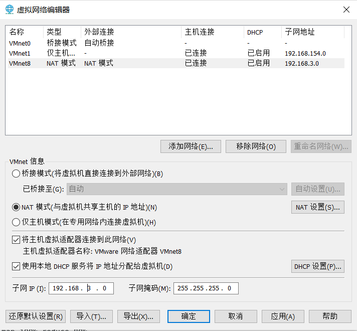
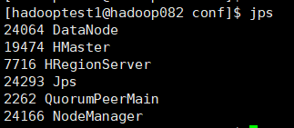
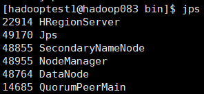
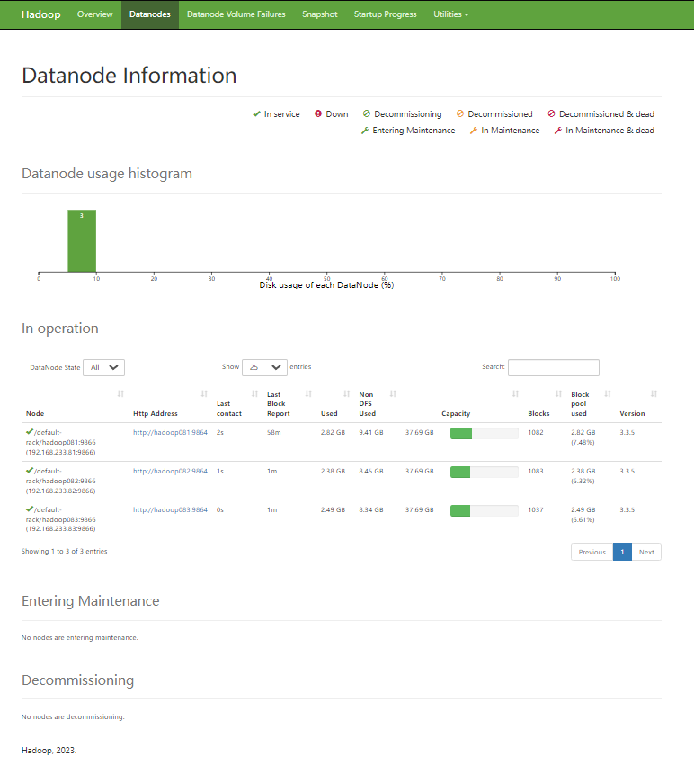
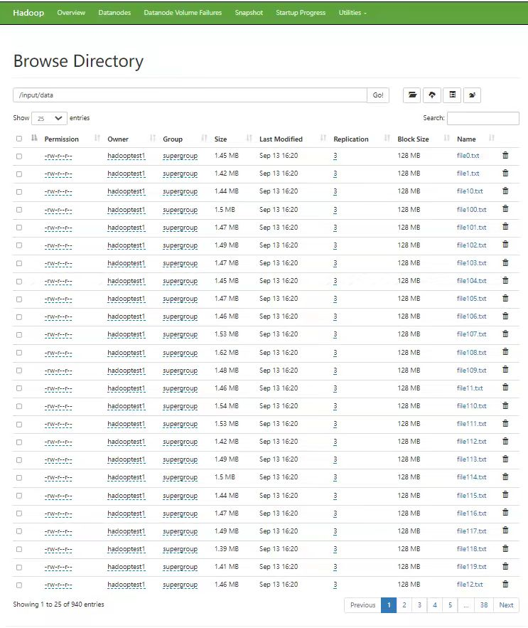

<div style="text-align: center;">
<br/>
<br/>
<br/>
<br/>

# 大数据系统开发实践实验报告


### 题　　目： 大数据系统开发实践  
### 学　　院： 计算机学院  
### 专业名称： 计算机科学与技术  
### 小组成员：  
成员1  
成员2  
成员3  

### 任课教师： 郭贵锁  

### 日　　期： 2024年9月14日  

</div>
<div style="page-break-after: always;"></div>

## 1.搜索引擎的技术方案
### 1.1功能描述
wkw负责写
### 1.2技术选型
随着搜索引擎需要处理超高并发和超大数据量，国内多数搜索引擎采用集中式架构，导致服务器性能要求高、可扩展性差、宽带浪费和重复性工作等问题，难以应对日益增长的数据规模。而基于分布式架构的搜索引擎，如Hadoop，能够提供高性能、低成本的解决方案，因此在搜索引擎中引入Hadoop是必要的。<br>
#### Hadoop 生态系统简介
Hadoop是Apache基金会开发的开源分布式系统基础架构，具有高扩展性和容错性。它的核心组件包括：<br>
- **HDFS（Hadoop Distributed File System）**：分布式存储系统，采用Master/Slave结构，负责将文件拆分成多个数据块存储在不同节点上。<br>
- **YARN（Yet Another Resource Negotiator）**：集群资源管理和任务调度的核心框架。<br>
- **MapReduce**：Hadoop的数据处理引擎，支持大数据的并行计算。<br>
- **HBase**：面向列的分布式数据库，适用于大规模数据的随机读写。<br>
- **Hive**：基于Hadoop的数据仓库工具，支持SQL查询。<br>
- **Spark**：通用的大数据快速计算引擎，适合低延迟和迭代处理需求。<br>
- **ZooKeeper**：分布式协调服务，负责系统的配置管理、同步和故障恢复。<br>
Hadoop的核心是HDFS提供存储支持，MapReduce负责数据计算。基于这些特点，Hadoop可以很好地满足分布式搜索引擎的需求。<br>
#### 1.2.1 Hadoop 的优势
1. **高效的数据处理**：通过MapReduce并行处理大量数据，能显著减少数据处理时间。例如，18GB数据在集群环境下比单机节省了4.8倍的时间。随着数据规模的增加，Hadoop的效率优势愈发明显。<br>
2. **开源与低成本**：Hadoop是开源平台，使用成本较低，团队可以将更多资金投入到应用开发中。开源带来了快速的技术更新和社区支持。<br>
3. **高扩展性**：Hadoop支持集群扩展，能动态添加计算节点，以满足不断增加的数据处理需求，且不会影响集群的性能。<br>
4. **安全性和容错性**：HDFS通过数据块的副本机制确保数据安全，系统可以从节点故障中快速恢复。Hadoop自动分配失败任务，确保任务的连续性和数据的完整性。<br>
5. **适合中小型团队**：Hadoop的架构能够减少对硬件的依赖，使中小型开发团队可以在有限的资源下实现高效的数据分析和搜索服务。<br>
#### 1.2.2 Hadoop 的劣势
尽管Hadoop有许多优势，但在某些场景中仍然存在一些局限性，特别是在Hadoop 3.x版本中体现得更为明显：<br>
1. **不适用于低延迟的数据访问**：Hadoop主要适合批处理任务，不适合需要快速响应的实时应用场景。<br>
2. **处理大量小文件效率低**：Hadoop的文件块默认大小为128MB或256MB，处理大量比块大小小得多的文件时（如小于1MB），效率较低。这些小文件会使NameNode超载，导致性能瓶颈。<br>
3. **不支持多用户同时写入和修改文件**：HDFS对文件的修改限制较多，无法灵活地进行多用户并发写入和修改操作。<br>
4. **安全性问题**：由于Hadoop使用Java编写，而Java作为一种广泛使用的语言，容易成为网络攻击的目标，Hadoop系统的安全性容易受到挑战。<br>
5. **处理开销大**：Hadoop依赖磁盘I/O，数据从磁盘读取和写入的过程耗时较长，特别是在处理PB级数据时，读写操作变得非常昂贵。Hadoop无法实现内存中计算，导致整体处理开销大。<br>
6. **仅支持批处理**：Hadoop的核心MapReduce引擎设计用于批处理任务，不适合流处理或需要低延迟的实时应用。<br>
7. **迭代处理效率低**：Hadoop的MapReduce模型不适合迭代处理，特别是在机器学习或需要多阶段处理的数据流中。每个阶段的输出必须作为下一个阶段的输入，缺乏灵活性。<br>
#### 1.2.3 结论
Hadoop凭借其高效、低成本、易扩展的特点，适合作为分布式搜索引擎的基础架构。然而，对于实时性要求高或涉及大量小文件的场景，Hadoop的效率会大打折扣。在这种情况下，可以考虑将Hadoop与其他大数据工具（如Spark）结合使用，以弥补其不足，提高搜索引擎的性能和灵活性。<br>
### 1.3 功能实现
yjx负责写
### 1.4 工作计划
dyh负责
### 1.5 组织结构
yjx负责写
### 1.6 软件质量保证
zjr负责

## 2.倒排索引的实现
### 2.1 实验要求
运用MapReduce算法计算,构建一个倒排索引, 将倒排索引存储在HBase中,数据为老师提供的sentence.txt文件。
### 2.2 实验进度
- 9.6-9.8 完成集群初步配置<br>
- 9.9-9.11 伪分布式和单机完全分布式集群启动成功<br>
- 9.12 完成倒排索引的代码编写<br>
- 9.13 完成三机完全分布式集群启动成功，单机完全分布式倒排运行成功<br>
- 9.14 三机完全分布式倒排运行成功
### 2.3 小组分工
每个人写自己的
### 2.4 数据准备
dyh负责写
### 2.5 环境的安装与配置
wkw负责写完全分布，yjx负责写伪分布
#### 2.5.1 伪分布
#### 2.5.2完全分布
1. 节点分配设计

| 节点编号 | 节点类型          | IP地址       | 角色/职责                                    | CPU核数 | 内存(GB) | 磁盘空间(GB) | 备注                         |
|----------|-------------------|--------------|----------------------------------------------|---------|-----------|---------------|------------------------------|
| 1        | NameNode           | 192.168.3.81  | 管理HDFS元数据，负责文件系统的命名空间和控制 | 2       | 2        | 40           | 主要负责元数据存储与查询       |
| 2        | SecondaryNameNode  | 192.168.3.83  | 协助NameNode备份元数据、检查点              | 8       | 2        | 40           | 作为NameNode的辅助节点         |
| 3        | DataNode           | 192.168.3.81  | 存储实际数据块，提供数据读写服务             | 2      | 2        | 40         | 每个DataNode存储HDFS数据块     |
| 4        | DataNode           | 192.168.3.82  | 存储实际数据块，提供数据读写服务             | 2      | 2        | 40          | 多个DataNode提供冗余和高可用性 |
| 5        | DataNode           | 192.168.3.83  | 存储实际数据块，提供数据读写服务             | 8      | 2        | 40          | 提供负载均衡和分布式存储       |
| 6        | ResourceManager    | 192.168.3.81  | 管理集群资源，调度计算任务                  | 2       | 2        | 40           | 负责资源调度                   |
| 7        | NodeManager        | 192.168.3.82  | 负责任务执行及资源管理                      | 2       | 2        | 40           | 管理YARN应用程序的容器         |
| 8        | NodeManager        | 192.168.3.83  | 负责任务执行及资源管理                      | 8       | 2        | 40           | 提供计算能力的分布式资源节点   |
| 9        | Zookeeper          | 192.168.3.83  | 提供分布式协调服务，管理集群节点状态         | 8       | 2        | 40          | 负责NameNode的高可用性和选举   |


2. 网络配置流程
- **设置IP地址**<br>
  需要修改主机VM8，虚拟网络编辑器和虚拟机网卡。<br>首先是VMnet8的设置：<br><br>
  将IP，网关和DNS的第三位调整一致。<br>
  然后设置虚拟网络编辑器：<br>
  <br>
  将子网的网段前三位改为与VMnet8的IP一致。<br>
  然后配置虚拟机网卡，在命令终端输入<br>
  ```
  vim /etc/sysconfig/network-scripts/ifcfg-ens33
  ```
  进入页面修改虚拟机的网卡如下图所示：<br>
    <br>
 至此，所有IP配置完毕
- **使用XShell连接**<br>
    如果可以使用XShell连接，说明本地的网络与虚拟机服务器之间的网络是畅通的，没有防火墙或其他网络障碍阻止连接。所以这步需要先关闭防火墙，确认访问端口开启，然后再用XShell连接，连接成功后ping外网和本机IP，保证网络畅通。<br>
    首先关闭防火墙，并检查防火墙状态:
    ```
    sudo systemctl stop firewalld
    sudo systemctl disable firewalld
    sudo systemctl status firewalld
    ```
    出现以下状态即为关闭成功：<br>
    然后检查开放的端口：
    ```
    sudo ss -tuln
    ```
    检查端口是否开放<br>
    
    可以看到22号端口是开放的。<br>
    然后我们使用XShell对其进行连接：<br>
    图示即为连接成功。<br>
    然后测试ping网络：<br>
    <br>
    如图即为成功ping通。至此已经完成XShell的连接.<br>
3. 软件安装和虚拟机复制
- **jdk安装**
- **hadoop安装**
- **zooKeeper安装**
- **hbase安装**
- **虚拟机复制**
    将样本机复制两次样本，一共有三台虚拟机，命名为hadoop081，hadoop082，hadoop083：<br>
    <br>
    将两台主机的网卡分别改为对应的IP，再修改其主机名。修改IP之前已经展示，接下来就展示主机名修改。命令输入：
    ```
    vim /etc/hostname
    ```
    <br>
    如上图为hadoop082主机名的修改。
4. 节点分配文件
- **core-site.xml**
    ```
    <configuration>
        <property>
                <name>fs.defaultFS</name>
                <value>hdfs://hadoop081:9000</value>
        </property>
        <property>
                <name>hadoop.tmp.dir</name>
                <value>/var/big_data</value>
        </property>
    </configuration>
    ```

- **hdfs-site.xml**
  ```
    <configuration>
        <property>
                <name>dfs.replication</name>
                <value>2</value>
        </property>
        <property>
                <name>dfs.namenode.secondary.http-address</name>
                <value>hdfs://hadoop083:9868</value>
        </property>
    </configuration>

  ```
- **yarn-site.xml**
    ```
    <configuration>
        <property>
                <name>yarn.nodemanager.aux-services</name>
                <value>mapreduce_shuffle</value>
        </property>
        <property>
                <name>yarn.resourcemanager.hostname</name>
                <value>hadoop081</value>
        </property>
        <property>
                <name>yarn.scheduler.minimum-allocation-mb</name>
                <value>256</value>
         </property>
         <property>
                <name>yarn.scheduler.maximum-allocation-mb</name>
                <value>1540</value>
         </property>
         <property>
                <name>yarn.nodemanager.resource.memory-mb</name>
                <value>1540</value>
        </property>
        <property>
                 <name>yarn.nodemanager.env-whitelist</name><value>JAVA_HOME,HADOOP_COMMON_HOME,HADOOP_HDFS_HOME,HADOOP_CONF_DIR,CLASSPATH_PREPEND_DISTCACHE,HADOOP_YARN_HOME,HADOOP_MAPRED_HOME</value>
        </property>
    </configuration>

    ```
- **mapred-site.xml**
  ```
  <configuration>
        <property>
                <name>mapreduce.framework.name</name>
                <value>yarn</value>
        </property>
  </configuration>
  '''
- **hbase-site.xml**
    ```
    <configuration>
        <property>
            <name>hbase.cluster.distributed</name>
            <value>true</value>
        </property>
        <property>
            <name>hbase.tmp.dir</name>
            <value>/opt/module/hbase-2.5.4/tmp</value>
        </property>
        <property>
            <name>hbase.unsafe.stream.capability.enforce</name>
            <value>false</value>
        </property>
        <property>
            <name>hbase.rootdir</name>
            <value>hdfs://hadoop081:9000/hbase</value>
        </property>
        <property>
            <name>hbase.zookeeper.quorum</name>
            <value>hadoop081,hadoop082,hadoop083</value>
        </property>
        <property>
            <name>hbase.zookeeper.property.dataDir</name>
            <value>/opt/module/zookeeper-3.8.2/zkData</value>
        </property>
        <property>
            <name>hbase.master.info.port</name>
            <value>16010</value>
        </property>
    </configuration>

    ```
- **zoo.cfg**
    ```
    # The number of milliseconds of each tick
    tickTime=2000
    # The number of ticks that the initial 
    # synchronization phase can take
    initLimit=10
    # The number of ticks that can pass between 
    # sending a request and getting an acknowledgement
    syncLimit=5
    # the directory where the snapshot is stored.
    # do not use /tmp for storage, /tmp here is just 
    # example sakes.
    dataDir=/opt/module/zookeeper-3.8.2/zkData
    # the port at which the clients will connect
    clientPort=2181
    # the maximum number of client connections.
    # increase this if you need to handle more clients
    #maxClientCnxns=60
    #
    # Be sure to read the maintenance section of the 
    # administrator guide before turning on autopurge.
    #
    # https://zookeeper.apache.org/doc/current/zookeeperAdmin.html#sc_maintenance
    #
    # The number of snapshots to retain in dataDir
    #autopurge.snapRetainCount=3
    # Purge task interval in hours
    # Set to "0" to disable auto purge feature
    #autopurge.purgeInterval=1

    ## Metrics Providers
    #
    # https://prometheus.io Metrics Exporter
    #metricsProvider.className=org.apache.zookeeper.metrics.prometheus.PrometheusMetricsProvider
    #metricsProvider.httpHost=0.0.0.0
    #metricsProvider.httpPort=7000
    #metricsProvider.exportJvmInfo=true
    server.1=hadoop081:2888:3888
    server.2=hadoop082:2888:3888
    server.3=hadoop083:2888:3888
    ```
5. 单机完全分布集群启动
   按照zookeeper，hdfs，yarn，hbase的顺序开启节点。完全启动后三台虚拟机的节点为：<br>
   - hadoop081：<br>
   <br>
   - hadoop082<br>
  <br>
   - hadoop083:<br>
  <br>
   最终在web访问集群：<br>
   
   

1. 三机完全分布集群网络配置
2. 三机完全分布集群启动
### 2.6 算法及实现
zjr负责写
### 2.7 运行结果与分析
- **运行结果**<br>
    首先使用java程序里面的UpLoad类将本地处理好的数据集上传到集群hdfs的“input/data/”目录下：<br>
    <br>
    如图表示上传成功。<br>
    使用hbase shell命令新建一个名为“InvertedIndexTable”的表格：
    ```
    create 'InvertedIndexTable'
    ```
    将jar包上传至虚拟机中。使用如下命令运行jar包：
    ```
    hadoop jar test.jar /input/data
    ```
    如图所示即为运行成功：<br>
    <br>
    最后在hbase shell里面查看表格：<br>
    
    输出无误，表示运行完成
- **运行时间对比**
    在完成伪分布式计算，单机分布式计算和三机分布式计算之后，我们对其运行时长进行对比，得以突出多机完全分布式的优越性。

### 2.8 总结（心得、体会）
每个人写一点